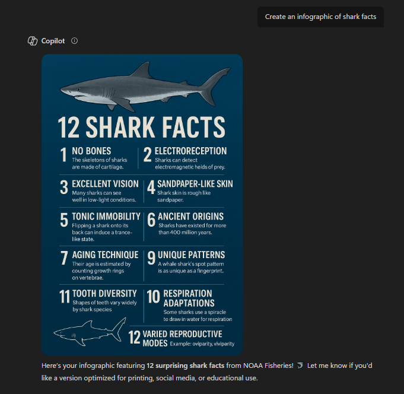



# Distant Reading Assignment 

I used Voyant to search this website: [Shark Website!](https://www.fisheries.noaa.gov/feature-story/12-shark-facts-may-surprise-you)

Here's my photo from using the "Links" tool:

---

I also tried Copilot, and here is a bit of our conversation:

 

I've tested other AI tools before, and they are typically not the best with image generation, so I wanted to test it out with CoPilot. The only major problem is that it skipped over fact number eight on the website, but it didn't recount on the infographic, so really, there are only 11 facts. I also wanted to test how it would take a summary of the webpage and then take that summary and rewrite it. In this instance, you can see that I asked for Co-Pilot to rewrite the summary, but this time explain it as if I were to explain it to a child. You can see how it brought down the level of vocabulary, but still kept it centered around those core facts. I think using CoPilot as a tool would be a lot more beneficial than using Voyant because there is just so much you can get out of using a tool like CoPilot, whereas Voyant is way more limited.
